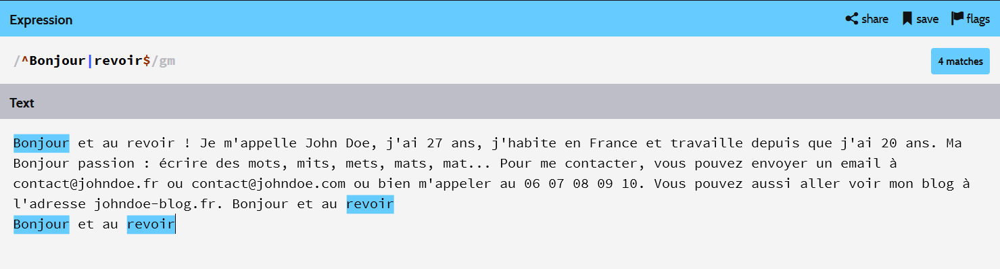
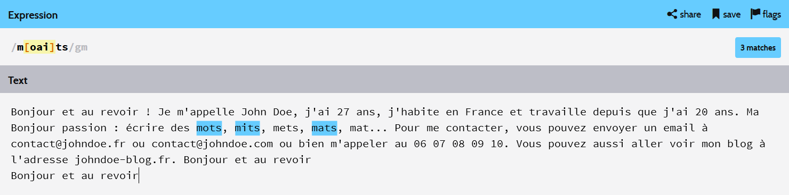
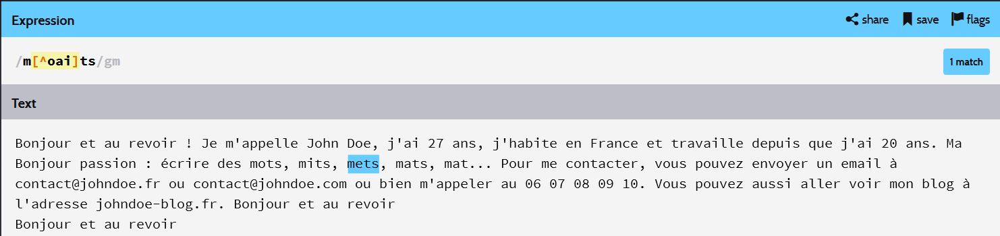
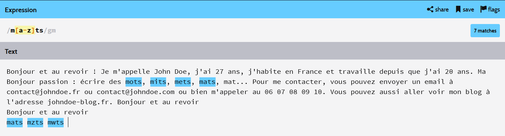
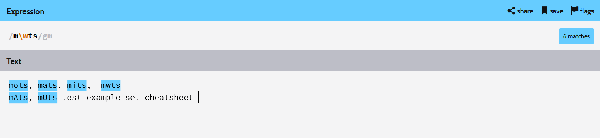
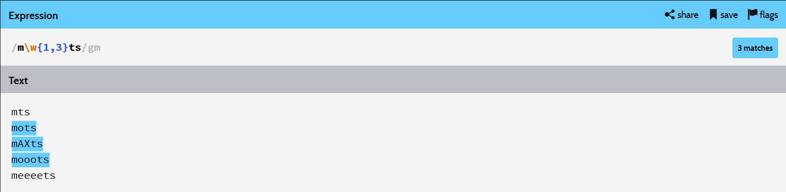

#Tutorial REGEX

Tool I used to test my regex :
http://www.regexr.com/

## 1) Search a word starting by Bonjour and ending by revoir  in multiple lines

Here's the text we'll use to test our regex's

_Bonjour et au revoir ! Je m'appelle John Doe, j'ai 27 ans, j'habite en France et travaille depuis que j'ai 20 ans. Ma passion : écrire des mots, mits, mets, mats, mat... Pour me contacter, vous pouvez envoyer un email à contact@johndoe.fr ou contact@johndoe.com ou bien m'appeler au 06 07 08 09 10. Vous pouvez aussi aller voir mon blog à l'adresse johndoe-blog.fr. Bonjour et au revoir_

We want to match the lines starting with Bonjour, and ending with revoir, the regular expression that we will use is :

  * /^Bonjour|revoir$/gm

 /gm : g means global text and m means multiple lines__
 ^ : to search X in the start of the line
 $ : to search Y in the end of the line
 | : to use multiple statements

look the example below

## 2) Search a subset of chars sharing some letters

We want to search for these words : mots,mats,mits

We could use this regex
 * mots|mats|mits

But, we can cross this regex, because the three words share the following letters : m,t,s  and we will match the words that have either o OR a OR i between m and ts so it gives us this :
 * /m[oai]ts/gm

this regex can be explained that way : search all the words that starts with __m__ and end with __ts__, and between them, match a word that have either the letter __o, or a, or i__

We can use this regex to do the "opposite" of what we want to match this way :

  * /m[^oai]ts/gm

this regex means : search all the words that starts with __m__ and ends with __ts__,  by exluding those which contain either __o,a,i__

### 3) Using intervals

We want to search for instance, all the words that starts with __m__ and ends with __ts__ , that contain either __a,b,c... to z__, we'll have to use intervals, this way :

  * /m[a-z]ts/gm

Well, there is pre-built intervals in regular expressions defined that way :

| interval | equivalent                             | meaning                                        |
|----------|----------------------------------------|------------------------------------------------|
| [a-z]    | [abcdefghijklmonpqrstuvwxyz]           | min letters from a to z                        |
| [A-Z]    | [ABCDEFGHIJKLMNOPQRSTUVWXYZ]           | maj from  A to Z                               |
| [0-9]    | [0123456789]                           | Numbers from 0 to 9                            |
| [a-z0-9] | [abcdefghijklmonpqrstuvwxyz0123456789] | min letters from a to z or numbers from 0 to 9 |

### 4) Another pre-built intervals

Another useful pre builts intervals like these :

| interval | equivalent         |
|----------|--------------------|
| .        | All possible chars |
| \w       | [a-zA-Z0-9_]       |
| \d       | [0-9]              |
| \n       | line break         |
| \t       | tab                |

example of using this regex :
 * /m\wts/gm

### 5) Quantifiers
Okay, now the problem is that we want to match __more than just 1 letter__ between __m and ts__, we'll have to use the quantifiers .

little explanation needed here for the following regex:

 * /m\wts/gm : this regex will match all the words that starts with __m and finish with ts__, which contain __ONLY ONE__ letter in the interval \w
 * /m\w{2}/gm : this regex will match all the words that starts with __m and finish with ts__, which contain __EXACTLY TWO__ letters in the interval \w, between m and ts
 * /m\w{1,}/gm : this regex will match all the words that starts with __m and finish with ts__, which contain __AT LEAST ONE__ letter in the interval \w, between m and ts
 * /m\w{,3}/gm : this regex will match all the words that starts with __m and finish with ts__, which contain __AT BEST THREE__ letters in the interval \w, between m and ts
 * /m\w{1,3}/gm : this regex will match all the words that starts with __m and finish with ts__, which contain __AT LEAST ONE AND AT BEST THREE__ letters in the interval \w, between m and ts

 Quick recap:

* {min,max}
* {min,}
* {,max}
* {number}

We'll test the last regex described above and the result is :

Well, you have to also know that there's pre-built intervals for the quantifiers described below :

| Quantifier | Description     | Equivalent |
|------------|-----------------|------------|
| *          | 0 or more chars | {0,}       |
| +          | 1 or more chars | {1,}       |
| ?          | 0 or 1 char     | {,1}       |

#End of tutorial

Here you go, the only limit for creating regex now is your imagination.
I would like to give credit to this guy who wrote the tutorial in french that I mainly translated and added some screens
-> https://www.lucaswillems.com/fr/articles/25/tutoriel-pour-maitriser-les-expressions-regulieres  
